# Lost & Found Application

A full‑stack web app to report lost/found items, verify claims with OTP, enable owner–claimant chat, and provide admin moderation and analytics.

- Roles: USER and ADMIN
- Modules: Items, Claims, Chats, Notifications, Admin Analytics, Audit Logs

## Features
- Post Lost/Found items (moderation: UNDER → APPROVED/REJECTED)
- File claims; OTP verification before chat
- Chat between owner and claimant (polling)
- Notifications for claims/chats/OTPs
- Admin dashboard (KPIs + charts)
- Audit logs for key actions
- Dark/Light theme

## Tech Stack
- Frontend: React 18 + TypeScript, TailwindCSS, shadcn/ui, React Router, Axios, Lucide, Recharts
- Backend: Java 17+, Spring Boot 3.x (MVC + Service + DAO over JDBC), Scheduler
- Database: MySQL 8.x

## System Architecture

```mermaid
flowchart LR
  subgraph Client["Browser"]
    U[User]
    A[Admin]
  end

  subgraph FE["React + TS (3000)"]
    App[App.tsx Router]
    Ctx[Auth/Theme/Preview Contexts]
    Pages[UserDashboard / AdminDashboard]
    Comp[AdminChatViewer]
    Svc[services: users/items/claims/chats/notifications/analytics/audit]
  end

  subgraph BE["Spring Boot (8080)"]
    Ctrl[REST Controllers]
    Srv[Services]
    DAO[DAOs / JDBC]
    Sch[Scheduler: OTP cleanup]
  end

  subgraph DB["MySQL"]
    users[(users)]
    items[(items)]
    claims[(claims)]
    chat_sessions[(chat_sessions)]
    chat_participants[(chat_participants)]
    chat_messages[(chat_messages)]
    notifications[(notifications)]
    otps[(otps)]
    audit_logs[(audit_logs)]
  end

  U --> FE
  A --> FE
  FE -->|HTTP/JSON| BE
  BE -->|JDBC| DB
```

## Database
- SQL: `database_setup.sql`
- Tables: users, items, claims, chat_sessions, chat_participants, chat_messages, notifications, otps, audit_logs
- Optional: remove seed INSERTs (demo data) for production

## Project Structure (high level)
- `frontend/src`
  - pages: LoginPage, RegisterPage, UserDashboard, AdminDashboard
  - components: AdminChatViewer, ui/*
  - contexts: AuthContext, ThemeContext, PreviewModeContext
  - services: api.ts, users.ts, items.ts, claims.ts, chats.ts, notifications.ts, adminAnalytics.ts, audit.ts
  - App.tsx, index.tsx
- `src/main/java/com/lostfound`
  - controller: User, Item, Claim, Chat, Notification, Analytics, Admin, AuditLog, Files (optional)
  - service: User, Item, Claim, Chat, Notification, AdminAnalytics, etc.
  - dao: UserDAO, ItemDAO, ClaimDAO, ChatDAO, NotificationDAO, AdminAnalyticsDAO, AnalyticsDAO, AuditLogDAO, OTPDAO
  - util: DBConnection, PasswordUtil
  - scheduler: OtpCleanupScheduler
  - LostAndFoundApplication.java (Spring Boot entry)

## Setup & Run
### 1) Database
- Import `database_setup.sql` into MySQL.
- Update DB credentials in `src/main/java/com/lostfound/util/DBConnection.java`.

### 2) Backend (Spring Boot)
- Requirements: Java 17+, Maven
- Commands:
  - `mvn -q -DskipTests package`
  - `mvn spring-boot:run`
- Runs at: http://localhost:8080

### 3) Frontend (React)
- Requirements: Node 18+
- Commands:
  - `cd frontend`
  - `npm install`
  - `npm start`
- Runs at: http://localhost:3000

### 4) CORS
- Enabled via WebConfig/CorsConfig for localhost:3000 → 8080.

## Key Workflows
- Item: UNDER → APPROVED/REJECTED (admin)
- Claim: PENDING → APPROVED (OTP) → Chat session created
- Chat: GET `/api/chats/{id}` returns `messages` (senderUserId, createdAt) + `participants` (userId)
- Notifications: CLAIM/CHAT/SYSTEM/OTP; read/unread
- Analytics: Admin KPIs and charts
- Audit: Action trail

## API (selected)
- Users: POST `/api/users/register`, POST `/api/users/login`, GET `/api/users`, GET `/api/users/{id}`, POST `/api/users/{id}/ban|unban`
- Items: GET `/api/items`, POST `/api/items`, PUT `/api/items/{id}/approve|reject`
- Claims: POST `/api/claims`, PUT `/api/claims/{id}/approve|reject`, POST `/api/claims/{id}/generate-otp`, POST `/api/claims/{id}/verify-otp`
- Chats: GET `/api/chats`, GET `/api/chats/{id}`, POST `/api/chats/{id}/message`, PUT `/api/chats/{id}/close`
- Notifications: GET `/api/notifications/user/{userId}`, POST `/api/notifications`
- Analytics/Admin: GET `/api/admin/dashboard`, GET `/api/admin/logs`

## Frontend Design Notes
- AdminChatViewer:
  - Sender label priority: username → email → alias → fallback ("User", "User 2")
  - Timestamp normalization (`createdAt/sent_at/ISO/epoch`)
  - Smart autoscroll near bottom
- Service layer centralizes Axios calls
- ThemeContext provides dark/light mode

## Clean‑up (optional for GitHub)
- Delete unused files if present: `com/lostfound/MainApp.java`, `controller/NotificationsController.java` (keep `NotificationController.java`), `service/EmailService.java`, `service/MatchingService.java`, `dao/AdminDAO.java`
- Frontend tests/metrics (if unused): `frontend/src/App.test.tsx`, `frontend/src/setupTests.ts`, `frontend/src/reportWebVitals.ts`, `frontend/src/logo.svg`
- Add `.gitignore` for: `target/`, `frontend/node_modules/`, `frontend/build/`, `.idea/`, `.vscode/`, logs, `.DS_Store`

## Troubleshooting
- Wrong chat times → ensure backend returns `createdAt`; frontend normalizes multiple formats
- Sender shows as "User" → ensure user fetch by ID works; alias fallback is used otherwise
- HTML instead of JSON → verify endpoint path; use Network tab to copy real API URL

## License
MIT (or your preferred license)

## Demo Script
1) User: Register/Login → Post Lost Item → Admin approves
2) User: File claim → Admin approves + generates OTP → User verifies
3) Chat created → exchange messages
4) Admin: View Analytics, Chats (AdminChatViewer), and Logs

---

# Full Setup Guide

## Prerequisites
- Java 17+
- Maven 3.8+
- Node.js 18+
- MySQL 8.x
- A terminal with PowerShell/CMD (Windows) or bash (macOS/Linux)

## Environment Variables
- Backend DB credentials are set in `src/main/java/com/lostfound/util/DBConnection.java`:
  - URL: `jdbc:mysql://localhost:3306/lostfound`
  - USER: `root`
  - PASSWORD: `your_password`
- Frontend API base URL is defined in `frontend/src/services/api.ts` (default `http://localhost:8080/api`).

## Database Setup (MySQL)
1. Open MySQL Workbench (or CLI) and run the script:
   - File: `database_setup.sql`
2. This creates 9 tables and optional sample data.
3. Optional for production: remove the sample INSERTs (default admin, sample users/items).

## Backend Setup (Spring Boot)
1. Configure DB credentials in `DBConnection.java`.
2. Install dependencies and build:
   - `mvn -q -DskipTests package`
3. Run the API server:
   - `mvn spring-boot:run`
4. Server runs at `http://localhost:8080`.
5. CORS: Ensure `WebConfig/CorsConfig` allows `http://localhost:3000`.

## Frontend Setup (React + TypeScript)
1. Go to `frontend/` folder.
2. Install dependencies: `npm install`
3. Start dev server: `npm start`
4. App runs at `http://localhost:3000`.

## End-to-End Run (First Time)
1. Start MySQL.
2. Import `database_setup.sql`.
3. Start backend (`mvn spring-boot:run`).
4. Start frontend (`npm start` inside `frontend`).
5. Open `http://localhost:3000`.

---

# Module Instructions (How to Use)

## Authentication (Login / Register)
- Pages: `LoginPage`, `RegisterPage`.
- Use email/username and password to login. Registered user is stored in `AuthContext`.

## Items Module
- Create (User): Go to UserDashboard → My Items → New Item.
- Required: title, location, date, type (LOST/FOUND), description (optional), image (optional).
- Moderation: Admin reviews items in AdminDashboard → Items and sets status UNDER → APPROVED/REJECTED.
- Browse: All approved items appear under UserDashboard → Browse with LOST/FOUND filters.

## Claims Module
- File claim: Browse → open item → File Claim with a short description.
- Admin reviews claim: AdminDashboard → Claims → Approve/Reject.
- OTP flow: On approve, admin or system triggers OTP. Claimant verifies via UI; if correct, chat session is created.

## Chat Module
- After OTP verification, both owner and claimant see the chat under their Chats tab.
- Messaging: Type and send; messages appear with username/alias and timestamp.
- Admin monitoring: AdminDashboard → Chats → open AdminChatViewer (read‑only monitor, can close chat if needed).

## Notifications Module
- Users receive notifications for claim updates, new chat messages, OTP, and system alerts.
- UserDashboard → Notifications shows unread/read items; mark as read to clear badges.

## Admin Analytics & Logs
- AdminDashboard → Analytics: KPIs and charts (items over time, claim status breakdown).
- AdminDashboard → Logs: View `audit_logs` trail of key actions.

---

# Troubleshooting
- Frontend fails to start or blank screen:
  - Ensure Node 18+, run `npm install` inside `frontend`.
  - React/Router versions aligned for CRA 5 (React 18, Router 6); already configured in `package.json`.
- Module not found: `reportWebVitals`:
  - Already removed import/call in `frontend/src/index.tsx`.
- API calls return HTML instead of JSON:
  - Check you’re calling the backend endpoint (`/api/...`) not `/` (frontend).
  - Use browser DevTools → Network → copy the exact URL.
- Wrong timestamps in chat:
  - Ensure backend returns `createdAt` (or `sent_at`); frontend normalizes various formats.
- Names in chat show as "User/User 2":
  - Ensure `/users/:id` endpoint returns username/email; otherwise component falls back to aliases.
